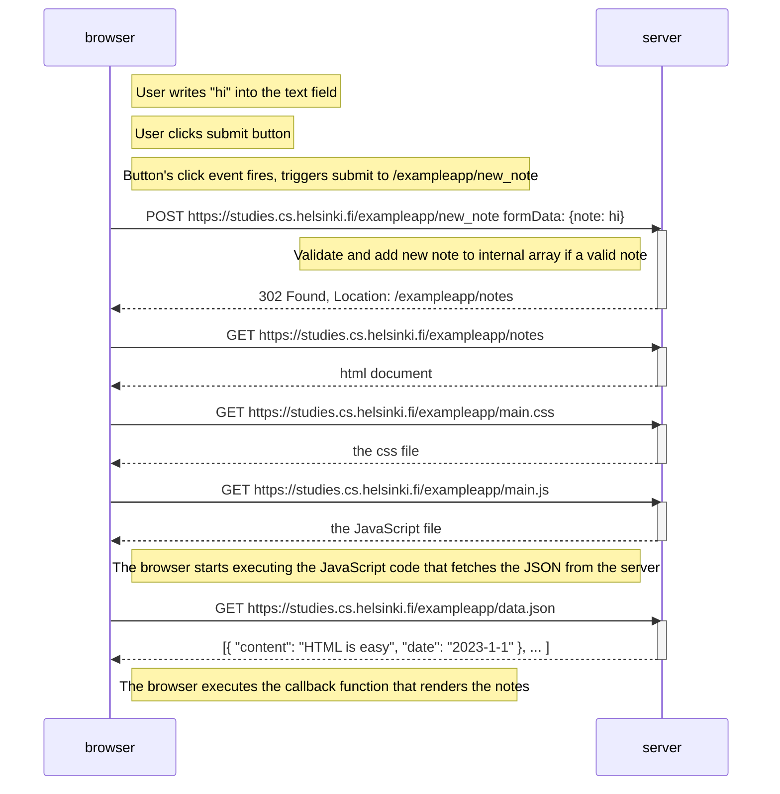

```mermaid
sequenceDiagram
    participant browser
    participant server
    Note right of browser: User writes "hi" into the text field
    Note right of browser: User clicks submit button
    Note right of browser: Button's click event fires, triggers submit to /exampleapp/new_note
    browser->>server: POST https://studies.cs.helsinki.fi/exampleapp/new_note formData: {note: hi}

    activate server
    Note left of server: Validate and add new note to internal array if a valid note
    server-->>browser: 302 Found, Location: /exampleapp/notes
    deactivate server

    browser->>server: GET https://studies.cs.helsinki.fi/exampleapp/notes
    activate server
    server-->>browser: html document
    deactivate server

    browser->>server: GET https://studies.cs.helsinki.fi/exampleapp/main.css
    activate server
    server-->>browser: the css file
    deactivate server

    browser->>server: GET https://studies.cs.helsinki.fi/exampleapp/main.js
    activate server
    server-->>browser: the JavaScript file
    deactivate server

    Note right of browser: The browser starts executing the JavaScript code that fetches the JSON from the server

    browser->>server: GET https://studies.cs.helsinki.fi/exampleapp/data.json
    activate server
    server-->>browser: [{ "content": "HTML is easy", "date": "2023-1-1" }, ... ]
    deactivate server

    Note right of browser: The browser executes the callback function that renders the notes
```
