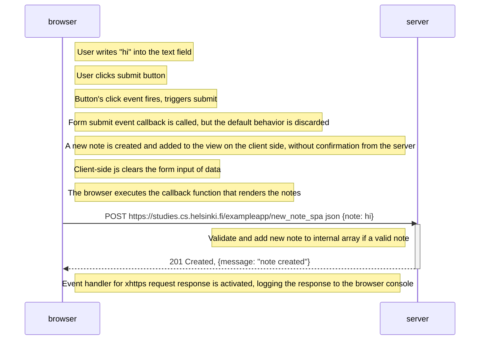

```mermaid
sequenceDiagram
    participant browser
    participant server
    Note right of browser: User writes "hi" into the text field
    Note right of browser: User clicks submit button
    Note right of browser: Button's click event fires, triggers submit
    Note right of browser: Form submit event callback is called, but the default behavior is discarded
    Note right of browser: A new note is created and added to the view on the client side, without confirmation from the server
    Note right of browser: Client-side js clears the form input of data
    Note right of browser: The browser executes the callback function that renders the notes
    browser->>server: POST https://studies.cs.helsinki.fi/exampleapp/new_note_spa json {note: hi}

    activate server
    Note left of server: Validate and add new note to internal array if a valid note
    server-->>browser: 201 Created, {message: "note created"}
    deactivate server

   Note right of browser: Event handler for xhttps request response is activated, logging the response to the browser console
```
